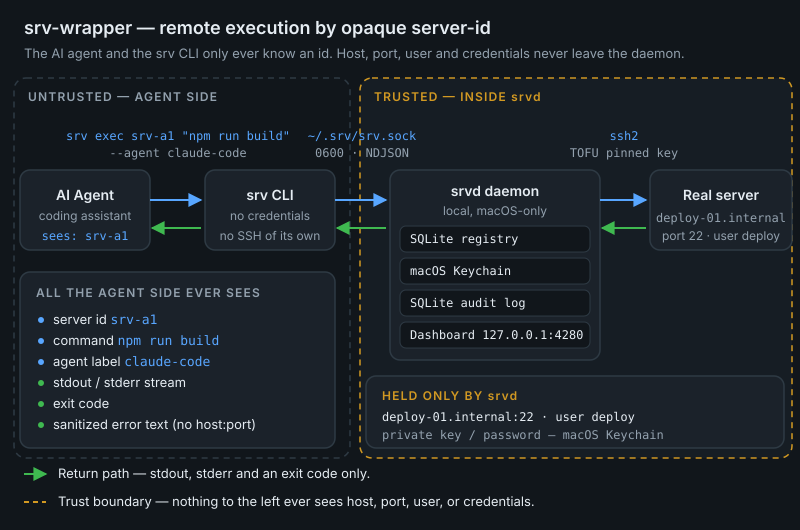
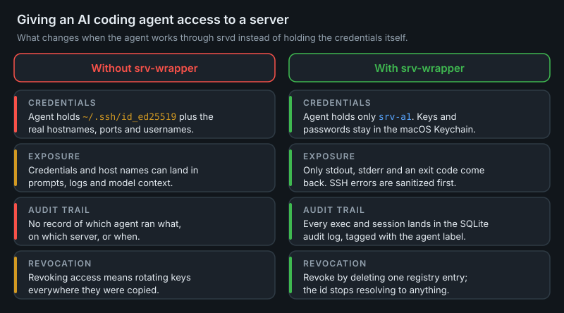

# srv-wrapper

**Let an AI agent run commands on your servers over SSH without ever giving it the credentials.** `srv-wrapper` is a local daemon + CLI for macOS that hides every hostname, IP, port, username, password and private key behind an opaque **server-id** like `srv-a1` — so your coding agent can `srv exec srv-a1 "npm run build"` while the real connection details stay in the macOS Keychain, and every command it runs is streamed to a local dashboard and written to a permanent audit log.

[](https://www.npmjs.com/package/@nhic-lab/srv-wrapper)
[](https://github.com/nhic-lab/srv-wrapper/blob/main/LICENSE)
[](https://nodejs.org)
[](https://github.com/nhic-lab/srv-wrapper)



## Table of contents

- [Quick start](#quick-start)
- [CLI reference](#cli-reference)
- [Why use it](#why-use-it)
- [How it works](#how-it-works)
- [Dashboard](#dashboard)
- [Security model](#security-model)
- [Running the daemon on login](#running-the-daemon-on-login)
- [Maintenance](#maintenance)
- [Requirements](#requirements)
- [Development](#development)
- [License](#license)

## Quick start

From zero to a working `srv exec` in four steps.

**1. Install**

```bash
npm install -g @nhic-lab/srv-wrapper   # exposes `srv` and `srvd` globally
```

<details>
<summary>Or install from a clone of this repo</summary>

```bash
git clone https://github.com/nhic-lab/srv-wrapper.git
cd srv-wrapper
npm install
npm run build
npm link              # exposes `srv` and `srvd` globally
```

To run the daemon without building or linking anything: `npm run dev:daemon`.

</details>

**2. Start the daemon**

```bash
srvd
```

It listens on a Unix socket at `~/.srv/srv.sock` and serves the dashboard on `127.0.0.1:4280`. (See [Running the daemon on login](#running-the-daemon-on-login) to have it start automatically.)

**3. Register a server**

Open **http://127.0.0.1:4280** and add a server: pick an id (`srv-a1`), then enter the host, port, username, auth method, and password or key passphrase. Those details are stored by the daemon and never leave it.

<!-- TODO(screenshot): dashboard "Add server" / registration form — run `srvd`, open http://127.0.0.1:4280, open the registration form, screenshot it, save as docs/assets/dashboard-register.png, then replace this comment with an  tag with descriptive alt text -->

**4. Run a command**

```bash
srv exec srv-a1 "uname -a" --agent my-agent-label
```

stdout and stderr stream back to your terminal, the CLI exits with the remote command's exit code, and the run appears live in the dashboard.

That's it — from here, point your AI agent at `srv` and it can operate the box without ever learning where the box is.

## CLI reference

```bash
# list the server ids you can talk to (ids only — no hosts)
srv list

# one-shot command
srv exec <server-id> "<command>" --agent <label>

# persistent session: state (cwd, env vars) survives across calls
srv session start <server-id> --agent <label>   # prints a session id
srv session send <session-id> "cd /var/www && ls"
srv session send <session-id> "pwd"             # still /var/www
srv session stop <session-id>
```

`--agent <label>` is required on every `exec` and `session start`. It is how the dashboard's live view tells concurrent agents apart and how the audit log attributes each run.

Sessions auto-close after 30 minutes of inactivity, so an abandoned session never pins a connection open.

### Use with Claude Code

A Claude Code skill (`.claude/skills/srv-wrapper/SKILL.md`, also symlinked into `~/.claude/skills/`) documents this CLI, so any Claude Code agent picks up the commands automatically — you can just say "check the nginx logs on `srv-a1`".

## Why use it

Handing an AI agent a real SSH key or password has two problems: the secret can leak (into a prompt, a transcript, a log file, a model provider's context), and you lose any reliable record of what the agent actually did on the remote box.

`srv-wrapper` sits between the agent and your servers. You register a server once; the agent only ever gets a short id; the daemon resolves that id to the real connection internally and records every byte of the result.



## How it works

- **`srvd`** — a background daemon holding the server registry (SQLite), secrets (macOS Keychain), SSH connections (`ssh2`, including jump-host chains), and the audit log (SQLite). It exposes exactly two local-only surfaces:
  - a Unix domain socket at `~/.srv/srv.sock` (mode `0600`) speaking newline-delimited JSON — this is what the CLI talks to;
  - an Express + WebSocket dashboard bound to `127.0.0.1` only.
- **`srv`** — the CLI an agent invokes. One-shot `exec`, persistent PTY sessions, and `list`. It resolves nothing itself; it knows only the socket and the id you give it.
- **Dashboard** — register servers, test reachability, watch a live feed of what every agent is running right now, and browse paginated history.

## Dashboard

Served at **http://127.0.0.1:4280** while `srvd` runs. It has three views:

### Servers

Register servers one at a time or via bulk JSON import, edit them, test connectivity individually or all at once, and delete them. Reachability results are persisted, so a refresh doesn't discard your last "Test all".

<!-- TODO(screenshot): dashboard server list view — run `srvd`, open http://127.0.0.1:4280, register at least one server, screenshot the list pane with a row selected, save as docs/assets/dashboard-list.png, then replace this comment with an  tag with descriptive alt text -->

### Live

Every `exec` and session in flight, streamed over WebSocket, labelled by the `--agent` value that started it.

<!-- TODO(screenshot): dashboard live command feed — run `srvd`, start a long-running `srv exec ... --agent demo`, screenshot the Live view mid-stream, save as docs/assets/dashboard-live.png, then replace this comment with an  tag with descriptive alt text -->

### History

Every past run: server id, agent label, command, exit code, timing, and full captured output. Paginated, newest first.

<!-- TODO(screenshot): dashboard history view — run `srvd`, execute a few commands, open the History view and select a run so its output is visible, screenshot it, save as docs/assets/dashboard-history.png, then replace this comment with an  tag with descriptive alt text -->

The dashboard supports light and dark themes and follows your system setting until you choose one explicitly.

<!-- TODO(screenshot): dark-mode dashboard — capture any view with the dark theme active, save as docs/assets/dashboard-dark.png, then replace this comment with an  tag with descriptive alt text -->

## Security model

- **Id-only boundary.** Servers are referenced everywhere by id. Real connection details never reach the CLI process, its output, or the audit log. SSH errors are sanitized before they are surfaced, because raw Node/`ssh2` errors routinely embed the real `host:port`.
- **Secrets in the Keychain.** Passwords and key passphrases live in the macOS Keychain, scoped by ACL to the daemon's own resolved path — not in the SQLite registry.
- **Pinned host keys.** SSH host keys are pinned on first use (TOFU) and persisted across daemon restarts.
- **Confined key files.** Private key files are restricted to paths that resolve (through symlinks) inside `~/.ssh`.
- **Local-only surfaces.** The socket is `0600` and the dashboard binds to `127.0.0.1` with an Origin check on the WebSocket upgrade.
- **No dashboard auth.** This is a deliberate trade-off for a tool that only ever binds to loopback on your own machine, not an oversight. Don't expose port 4280 beyond localhost.

## Running the daemon on login

```bash
./scripts/install-launchd.sh
```

This installs a `launchd` agent (`~/Library/LaunchAgents/com.srv-wrapper.daemon.plist`) that runs the built daemon and restarts it if it crashes. Logs go to `~/.srv/daemon.log` and `~/.srv/daemon.error.log`.

> This writes outside the project directory and changes what starts on login. Run it deliberately.

## Maintenance

Captured output is capped at write time (128 KB head + 128 KB tail, with an elision marker), so a runaway `mysqldump` can't bloat the audit database. To retro-fit that cap onto rows recorded before the cap existed and reclaim the space:

```bash
# stop the daemon first
npm run compact-log -- --yes
```

## Requirements

- macOS (the daemon uses the macOS Keychain via the `security` CLI)
- Node.js >= 20

## Development

```bash
npm install
npm run build                                  # src/ -> dist/
npm test                                       # vitest run
npx tsc -p tsconfig.json --noEmit              # typecheck
npm run dev:daemon                             # run the daemon via tsx, no build step
```

Architecture notes and conventions live in [`CLAUDE.md`](CLAUDE.md); the full design spec and implementation plan are under [`docs/superpowers/`](docs/superpowers/).

## License

MIT — see [LICENSE](LICENSE).
